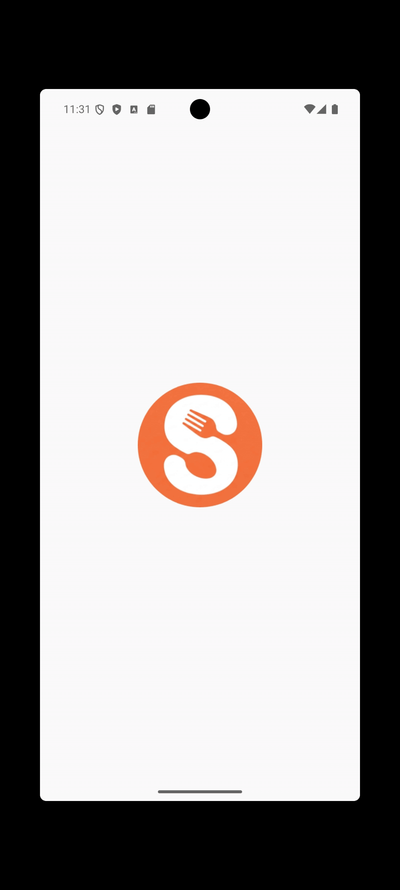
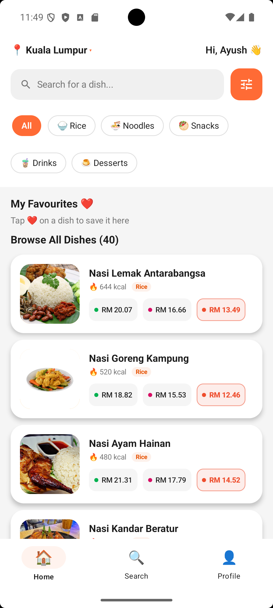
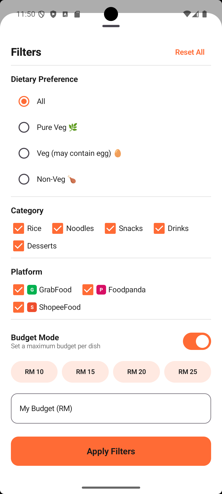
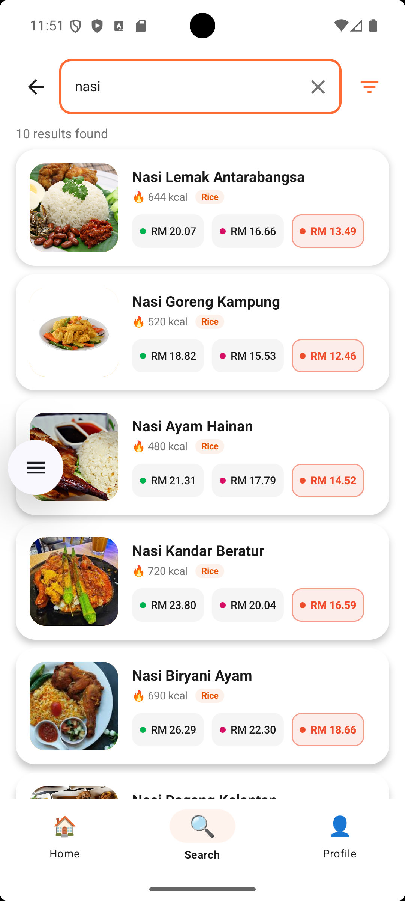
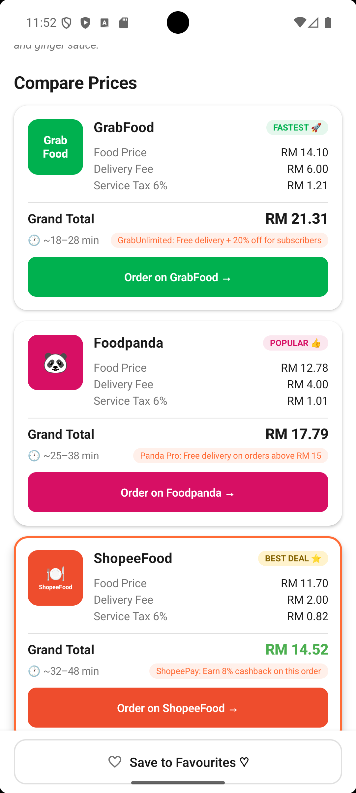
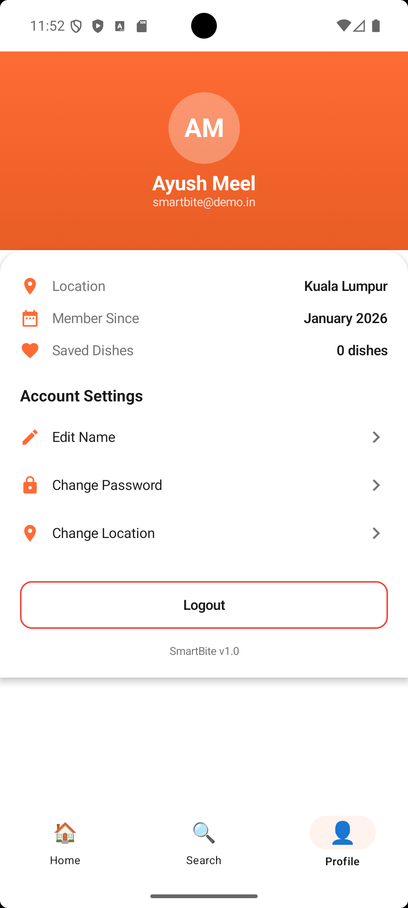

# 🍽️ SmartBite — Malaysia's Smartest Food Price Comparison App


> **Stop overpaying for delivery. See the full cost — delivery fee, markup, and tax — before you even open a delivery app.**

[🌐 Live Demo](#-live-demo) • [📱 Features](#-features) • [🏗️ Architecture](#️-architecture) • [🚀 Getting Started](#-getting-started) • [🎯 Future Goals](#-future-goals)

---

## 🌐 Live Demo

You don't need Android Studio to try SmartBite! You can run the app directly in your browser using our live emulator:

👉 **[Try SmartBite Live on Appetize.io](https://appetize.io/app/b_63finyfnwbz5oro72bb6xqr3t4)**

---

## 📸 Screenshots

<div align="center">
  
  
  
</div>
<br/>
<div align="center">
  
  
  
</div>

> 📂 *All high-resolution screenshots are available in the [`screenshots/`](screenshots/) directory.*

---

## 🤔 The Problem

Every day, millions of Malaysians order food online — but they have **no idea what the true cost is until checkout**. Every platform hides the real price behind:

- 📦 **Delivery fees** shown only at the very end of checkout
- 💸 **Platform markups** baked silently into the food price
- 🧾 **6% SST** added on top of everything

The same Nasi Lemak can cost **RM 19.14 on GrabFood** and only **RM 13.38 on ShopeeFood** — that's a 43% difference for the identical meal. Most people never find out because comparing across apps is too tedious, and the delivery fee only reveals itself at the last step of checkout.

**I built SmartBite to fix that.**

---

## 💡 The Solution

SmartBite is a native Android app that shows you the **true all-in price** — food markup + delivery fee + SST — across **GrabFood, Foodpanda, and ShopeeFood** for 40+ authentic Malaysian dishes, all on one screen, before you open a single delivery app.

Other platforms only show you the delivery fee at the very end. **SmartBite shows it first.**

One screen. Three platforms. Zero surprises.

---

## ✨ Features

### 💰 True Price Comparison — Upfront, Not at Checkout
- Full cost breakdown per platform: food price (with markup), delivery fee, SST (6%), and grand total.
- Automatic **"Best Deal"** badge on the cheapest option.
- Promo tips per platform (GrabUnlimited, Panda Pro, ShopeePay cashback).
- **"Order Now"** button deep-links directly into the selected platform.

### 🥘 40+ Malaysian Dishes Catalogue
- Categories: **Rice · Noodles · Snacks · Drinks · Desserts**
- Full nutritional info per dish: calories, protein, carbs, fat.
- Dietary classifications: Pure Veg 🌿 · Veg+Egg 🥚 · Non-Veg 🍗
- High-quality dish photos for every item.

### 🔎 Advanced Filtering & Search
- Filter by dietary type, food category, and platform.
- **Budget Mode** — enter your max budget, see only dishes you can actually afford (including all fees) on your chosen platforms.
- Instant real-time search across the entire dish database.

### ❤️ Favourites & Personalisation
- Save favourite dishes (requires login).
- Malaysian state-based location personalisation.
- Persistent login session via `SharedPreferences`.

### 🎨 Polished UI/UX
- Built entirely with Jetpack Compose + Material 3.
- Smooth animated navigation (fade, slide, expand/collapse).
- Animated bottom navigation bar.
- Custom splash + success onboarding flow.
- **Guest mode** — full catalogue access with no sign-up required.

---

## 🏗️ Architecture

SmartBite is built using the **MVVM (Model-View-ViewModel)** architectural pattern, combined with a **Repository Pattern** for clean data handling:

```text
smartbites/
├── README.md                          # The comprehensive documentation file
├── LICENSE                            # The MIT License open-source rights
├── screenshots/                       # High-res UI captures and GIFs
│   ├── screen_welcome.gif
│   ├── screen_home.png
│   ├── screen_filter.png
│   ├── screen_search.png
│   ├── screen_comparison.png
│   └── screen_profile.png
├── app/
│   ├── build.gradle.kts
│   └── src/main/
│       ├── AndroidManifest.xml
│       ├── java/com/smartbite/app/
│       │   ├── AppState.kt                    # Singleton state holder
│       │   ├── MainActivity.kt
│       │   ├── data/
│       │   │   ├── local/
│       │   │   │   └── DishDataSource.kt      # 40+ hardcoded dishes
│       │   │   ├── model/
│       │   │   │   └── Models.kt              # Dish, PlatformPrice, User, FilterState
│       │   │   └── repository/
│       │   │       ├── DishRepository.kt      # Search, filter, price retrieval
│       │   │       ├── FavouritesRepository.kt
│       │   │       └── UserRepository.kt      # SharedPreferences auth
│       │   ├── domain/
│       │   │   ├── Constants.kt               # Platform markups, fees, URLs
│       │   │   ├── PriceCalculator.kt         # Core price engine
│       │   │   └── ValidationUtils.kt
│       │   └── presentation/
│       │       ├── navigation/
│       │       │   └── NavGraph.kt            # Sealed routes + animated nav
│       │       ├── screens/                   # Compose UI layers
│       │       ├── components/                # Reusable Compose Widgets
│       │       └── theme/                     # Material 3 typography & colours
│       └── res/
└── gradle/
```

### 🔧 Tech Stack

| Layer | Technology |
|-------|------------|
| **Language** | Kotlin |
| **UI Framework** | Jetpack Compose + Material 3 |
| **Navigation** | Navigation Compose (sealed type-safe routes) |
| **State Management** | ViewModel + `mutableStateOf` |
| **Data Persistence** | SharedPreferences (user session) |
| **Architecture Pattern** | MVVM + Repository |
| **Build System** | Gradle KTS |
| **Min SDK** | API 26 (Android 8.0 Oreo) |
| **Target SDK** | API 35 (Android 15) |

### 💰 Price Calculation Engine

The `PriceCalculator` models real-world platform economics for every dish dynamically:

```kotlin
// Example: Nasi Lemak Antarabangsa (Base Price: RM 11.00)

GrabFood   → RM 11.00 × 1.175 markup + RM 6.00 delivery + 6% SST  =  RM 19.14
Foodpanda  → RM 11.00 × 1.065 markup + RM 4.00 delivery + 6% SST  =  RM 16.22
ShopeeFood → RM 11.00 × 0.975 markup + RM 2.00 delivery + 6% SST  =  RM 13.38  ✅ Best Deal
```

Every number the user sees is the **final amount** — no hidden fees revealed at checkout.

---

## 📱 Screens

| Screen | What It Does |
|--------|-------------|
| **Welcome** | Login / Register / Guest entry with animated onboarding |
| **Home** | Dish grid with category tabs, search bar, and filter toggle |
| **Search** | Instant real-time search across all 40+ dishes |
| **Comparison** | Full itemised price breakdown across all 3 platforms for any dish |
| **Filter Sheet** | Bottom sheet — dietary, category, platform, and budget mode filters |
| **Profile** | User info, Malaysian state, favourites count, logout |

---

## 🚀 Getting Started

### Prerequisites
- Android Studio Hedgehog or later
- JDK 11+
- Android device or emulator (API 26+)

### Run Locally

```bash
git clone https://github.com/meel-ayush/smartbites.git
cd smartbites
```

Open the project in Android Studio → select your device → click ▶ **Run**

> *No API keys or internet connection required. The app runs fully offline.*

### 🔑 Demo Credentials

Use these to log in and explore the full app instantly:

| Field | Value |
|-------|-------|
| **Email** | `smartbite@demo.in` |
| **Password** | `demo123++` |

> *Or tap **Continue as Guest** on the Welcome screen — no login needed to browse the full dish catalogue and comparison screens.*

---

## ⚠️ Current Data & Storage

SmartBite v1.0 has **no backend database**. All dish data (40+ items, prices, nutrition info) is stored locally in `DishDataSource.kt` as hardcoded Kotlin objects. User sessions (login state, name, Malaysian state) are saved via Android's `SharedPreferences` — they persist across app restarts on the same device but are not synced to any server.

This was a deliberate choice to keep v1.0 fully offline, responsive, and dependency-free while the core UX and price engine were being built and validated.

---

## 🎯 Future Goals

Here's what's planned next:

- [ ] **Cloud database & backend** — Firebase Firestore or a REST API to replace hardcoded local data, enabling multi-device sync and real user accounts.
- [ ] **Real-time pricing** — Live data fetched directly from GrabFood, Foodpanda & ShopeeFood.
- [ ] **GPS-aware delivery fees** — Actual fees based on your real distance from restaurants.
- [ ] **Restaurant-level search** — Find specific restaurants and their full menus.
- [ ] **Price history & alerts** — Track price changes, get push notifications on drops.
- [ ] **Promo aggregator** — Surface active discount codes and cashback offers automatically.
- [ ] **Meal planning mode** — Plan your week and compare total spend across platforms.
- [ ] **Community reviews** — User ratings and photos for dishes.

---

## 🎯 Why This Project?

SmartBite tackles a real problem affecting millions of Malaysians daily. Delivery platforms deliberately reveal fees late in checkout to reduce cart abandonment — SmartBite flips that model by putting complete pricing transparency front and centre.

This project demonstrates:
- End-to-end native Android development with Jetpack Compose.
- Custom business logic design (price modelling with real-world platform economics).
- Production-grade UI with reusable components, animations, and bottom sheets.
- Clean MVVM architecture designed to be extended with real API integration.

---

## 🧑‍💻 Developer

**Ayush Meel**

[](https://linkedin.com/in/ayushmeel)
[](https://github.com/meel-ayush)

---

## 📄 License

This project is licensed under the [MIT License](LICENSE).

*In short: You are free to use, modify, and distribute this software, but it comes with no warranties. Do whatever you want with it, just keep the original copyright notice!*

---

<div align="center">
  <i>Built with ❤️ and a lot of Teh Tarik ☕ in Malaysia</i>
</div>
